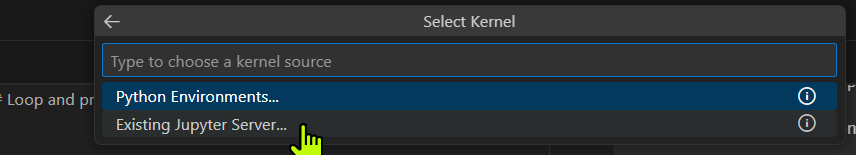

# RAG Jupyter Notebook Tutorials

A collection of hands-on tutorials for building Retrieval Augmented Generation (RAG) systems using Jupyter notebooks. These tutorials cover fundamental concepts like PDF processing, text chunking, embeddings, and vector databases.

## Setup Instructions

### Prerequisites
- Python 3.8 or higher
- Conda (Miniconda or Anaconda)

### Installing Jupyter Lab

#### Windows 10/11
```bash
# Using conda with conda-forge (recommended)
conda install -c conda-forge jupyterlab

# Alternative: Using pip
pip install jupyterlab
```

**Why use conda-forge?**
- **More up-to-date packages**: conda-forge often has newer versions than the default conda channels
- **Better package compatibility**: Packages are built with consistent dependencies
- **Community-maintained**: Active community ensures quality and rapid updates
- **Broader package selection**: Many packages are only available through conda-forge

#### Linux (Ubuntu)
```bash
# Update package list
sudo apt update

# Install pip if not already installed
sudo apt install python3-pip

# Using conda with conda-forge (recommended)
conda install -c conda-forge jupyterlab

# Alternative: Using pip
pip install jupyterlab
```

### Starting Jupyter Lab

#### Windows
Use the provided batch script (recommended):
```bash
Windows_Start_Jupyter_Lab_Server.bat
```

**About the Windows Batch Script:**
The `Windows_Start_Jupyter_Lab_Server.bat` file is a convenient startup script that:
- Automatically navigates to the project directory
- Activates your conda environment
- Starts Jupyter Lab with no browser and disabled authentication
- Accepts command line arguments for customization

**Usage:**
```bash
# Use default settings (configured in the script)
Windows_Start_Jupyter_Lab_Server.bat

# Customize root directory, conda scripts path, and environment
Windows_Start_Jupyter_Lab_Server.bat "C:\your\project\path" "C:\your\miniconda3\Scripts" "your_env_name"
```

**Script Parameters:**
- `ROOT_DIR`: Directory where Jupyter Lab will start (default: current project directory)
- `MINICONDA_SCRIPTS_DIR`: Path to your miniconda Scripts folder (default: `C:\Users\gknerr\miniconda3\Scripts`)
- `CONDA_ENV`: Conda environment to activate (default: `langchain_common_py3.12`)

Or start manually:
```bash
jupyter lab --no-browser --port=8888
```

#### Linux
```bash
jupyter lab --no-browser --port=8888
```

## Connecting to Jupyter Lab Server

After starting the Jupyter Lab server using the batch script or command line, you'll need to connect to it through your web browser. Here's how:

### Step 1: Copy the Server URL
When Jupyter Lab starts, it displays server URLs in the terminal. Look for output similar to:


The server will display URLs like:
- `http://localhost:8888/lab`
- `http://127.0.0.1:8888/lab`

### Step 2: In VS Code - Select Kernel


### Step 3: In VS Code - Select Existing Jupyter Server



### Step 4: In VS Code - Paste the URL


### Step 5: In VS Code - Answer Yes


### Step 6: In VS Code - Select localhost


### Step 7: In VS Code - Select our conda env langchain_common_py3.12


**Important Notes:**
- Don't close the terminal window while using Jupyter Lab
- To stop the server, press `Ctrl+C` in the terminal
- The server URL includes `localhost` or `127.0.0.1` - this means it's only accessible from your local machine
- If you need to restart the server, just run the batch script again

## Python Dependencies

### Testing Required Modules
Before running the notebooks, test if required modules are installed in your conda environment:

```python
# Test script to check if required modules are available
import sys

required_modules = [
    'langchain',
    'langchain_community',
    'fitz',  # PyMuPDF (imported as fitz)
    'os',
    'pandas',
    'numpy'
]

missing_modules = []

for module in required_modules:
    try:
        __import__(module)
        print(f"✅ {module} - Available")
    except ImportError:
        print(f"❌ {module} - Missing")
        missing_modules.append(module)

if missing_modules:
    print(f"\nInstall missing modules with pip (see installation guide below)")
else:
    print("\n🎉 All required modules are available!")
```

### Installing Required Dependencies

Create a `requirements.txt` file and install dependencies:

```bash
# Create requirements.txt with the following content:
# langchain
# langchain-community
# PyMuPDF
# pandas
# numpy
# jupyter

# Install all requirements
pip install -r requirements.txt

# Or install individually
pip install langchain langchain-community PyMuPDF pandas numpy jupyter
```

### Using Conda Environment (Recommended)
```bash
# Create a new conda environment with Python 3.12
conda create -n langchain_common_py3.12 python=3.12

# Activate the environment
conda activate langchain_common_py3.12

# Install available packages using conda-forge
conda install -c conda-forge langchain pandas numpy jupyterlab

# Install packages via pip (not available in conda-forge)
pip install langchain-community PyMuPDF
```

**Note about langchain-community and PyMuPDF:** These packages are not available through conda-forge, so they must be installed using pip even within a conda environment. This is a common pattern for specialized packages.

### Alternative: Using Python venv
```bash
# Create a virtual environment
python -m venv rag_tutorials_env

# Activate the environment
# Windows:
rag_tutorials_env\Scripts\activate
# Linux/Mac:
source rag_tutorials_env/bin/activate

# Install dependencies
pip install langchain langchain-community PyMuPDF pandas numpy jupyterlab
```

### Alternative: Using uv (Fast Python Package Manager)
[uv](https://github.com/astral-sh/uv) is a fast Python package installer and resolver, gaining popularity as a modern alternative:

```bash
# Install uv first
pip install uv

# Create a virtual environment with uv
uv venv rag_tutorials_env

# Activate the environment
# Windows:
rag_tutorials_env\Scripts\activate
# Linux/Mac:
source rag_tutorials_env/bin/activate

# Install dependencies with uv (much faster than pip)
uv pip install langchain langchain-community PyMuPDF pandas numpy jupyterlab
```

## Notebook Index

### 1. Reading PDF and Chunking Tutorial
**File:** `reading_pdf_chunking_tutorial.ipynb`

**Description:** Learn the fundamentals of PDF processing for RAG systems. This beginner-friendly tutorial covers:
- Loading PDF documents using LangChain's PyMuPDFLoader
- Extracting text content page by page
- Understanding automatic document chunking
- Inspecting document metadata
- Working with Document objects for downstream processing

**Key Concepts:**
- PDF text extraction
- Document chunking strategies
- Metadata preservation
- LangChain document loaders

**Prerequisites:** Basic Python knowledge
**Estimated Time:** 15-20 minutes

## Getting Started

1. Clone this repository
2. Set up your Python environment using the instructions above
3. Install required dependencies
4. Start Jupyter Lab using the provided batch script (Windows) or command line
5. Open the desired notebook and follow along

## Resources

The notebooks include references to free, legal sources for medical PDFs that can be used for testing:
- CDC (Centers for Disease Control)
- NIH (National Institutes of Health) 
- WHO (World Health Organization)
- PubMed Central open access papers
- Medical education resources

## Contributing

Feel free to contribute additional tutorials, improvements, or bug fixes through pull requests.

## License

This project is open source and available under the MIT License.
